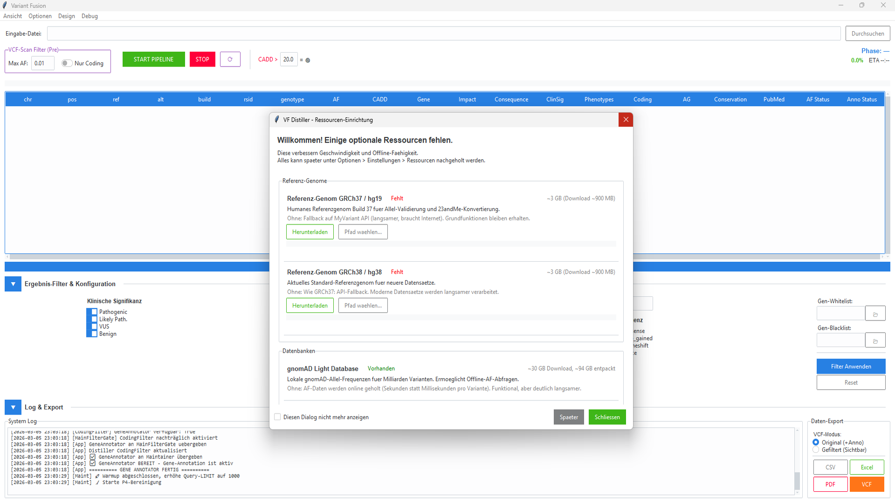

# VFDistiller — Variant Fusion Distiller

Bioinformatisches Desktop-Tool zur Verarbeitung, Konvertierung und Annotation genetischer Variantendaten. Unterstuetzt VCF, gVCF, 23andMe-Rohdaten und FASTA — ohne pysam/bcftools/samtools (Windows-kompatibel).



## Features

- **Multi-Format-Import** — VCF, gVCF, 23andMe (.txt), FASTA (.fa/.fasta)
- **Automatische Build-Erkennung** — GRCh37 / GRCh38 aus Header, Contigs oder RSID-Positionen
- **Multi-Source-Annotation** — gnomAD, MyVariant.info, Ensembl VEP, ALFA, TOPMed, AlphaGenome
- **INFO-Recycling** — Vorhandene VCF-Annotationen werden wiederverwendet
- **Filterung** — AF-Schwelle, CADD-Score, Variant Impact, ClinSig, Genlisten, FILTER=PASS, Read Depth
- **Export** — CSV, Excel, PDF, annotiertes VCF (gefiltert oder vollstaendig)
- **GUI** — ttkbootstrap-Oberflaeche mit System-Tray, Fortschrittsanzeige, Themes
- **Performance** — Optionaler Cython-Hotpath (5x Gesamt-Speedup), SQLite-Batch-Writes, async HTTP via aiohttp
- **Hintergrund-Wartung** — Automatisches Nachladen fehlender Annotationen im Leerlauf
- **Mehrsprachig** — Deutsch und Englisch (JSON-basierte Uebersetzungen)

## Voraussetzungen

- Python 3.10+
- Windows 10/11 (primaer getestet), Linux/macOS experimentell

### Installation

```bash
# Abhaengigkeiten installieren
pip install -r requirements.txt

# Optional: Cython-Beschleunigung (erfordert C-Compiler)
pip install cython
cd cython_hotpath
python setup.py build_ext --inplace
cd ..
```

### Genomreferenzen (optional, fuer FASTA-Validierung)

Die Genomreferenzen (GRCh37/GRCh38) muessen separat heruntergeladen werden (~3 GB pro Build):

```bash
# GRCh37
wget https://ftp.ensembl.org/pub/grch37/current/fasta/homo_sapiens/dna/Homo_sapiens.GRCh37.dna.primary_assembly.fa.gz
gunzip Homo_sapiens.GRCh37.dna.primary_assembly.fa.gz

# GRCh38
wget https://ftp.ensembl.org/pub/release-112/fasta/homo_sapiens/dna/Homo_sapiens.GRCh38.dna.primary_assembly.fa.gz
gunzip Homo_sapiens.GRCh38.dna.primary_assembly.fa.gz
```

Die Dateien ins Projektverzeichnis legen. Beim ersten Start wird automatisch ein `.fai`-Index erzeugt.

### gnomAD LightDB (optional)

Fuer schnelle Offline-AF-Lookups kann die gnomAD LightDB heruntergeladen werden. Das Tool bietet beim ersten Start einen Download-Dialog an. Alternativ:

```bash
python "Get gnomAD DB light.py"
```

## Verwendung

### GUI starten

```bash
python Variant_Fusion_pro_V17.py
```

Oder unter Windows:

```
START.bat
```

### Workflow

1. **Datei oeffnen** — VCF, gVCF, 23andMe-Textdatei oder FASTA waehlen
2. **Build pruefen** — Wird automatisch erkannt, kann manuell ueberschrieben werden
3. **Pipeline laeuft** — Varianten werden geparst, annotiert und gefiltert
4. **Ergebnisse** — Tabellenansicht mit sortierbaren Spalten, Doppelklick oeffnet externe Datenbanken
5. **Export** — CSV, Excel, PDF oder annotiertes VCF exportieren

### Konfiguration

Beim ersten Start wird `variant_fusion_settings.json` aus der Vorlage `variant_fusion_settings.json.example` erstellt. Wichtige Einstellungen:

| Einstellung | Beschreibung | Standard |
|---|---|---|
| `af_threshold` | Allele-Frequency-Schwelle | 0.007 |
| `include_none` | Varianten ohne AF anzeigen | false |
| `cadd_highlight_threshold` | CADD-Score-Hervorhebung | 22.0 |
| `stale_days` | Tage bis AF-Refresh | 200 |
| `alphagenome_key` | Google AlphaGenome API-Key | (leer) |
| `quality_settings` | VCF-Record-Level Filter | siehe Example |

### API-Keys

- **AlphaGenome**: Erfordert einen Google AI API-Key. In `variant_fusion_settings.json` unter `alphagenome_key` und `api_settings.phase6_ag.alphagenome.api_key` eintragen.
- **NCBI**: Optional fuer hoehere Rate-Limits. Unter `api_settings.global.ncbi_api_key` eintragen.

## Dependencies

### Core (erforderlich)

| Paket | Lizenz | Zweck |
|---|---|---|
| requests | Apache 2.0 | HTTP-Requests |
| psutil | BSD | CPU/Memory-Monitoring |
| Pillow | PIL License | Icon/Image-Processing |
| intervaltree | Apache 2.0 | Genomische Intervalle |
| ttkbootstrap | MIT | Moderne GUI-Themes |
| pystray | MIT | System-Tray-Icon |
| aiohttp | Apache 2.0 | Async HTTP-Fetching |
| scipy | BSD | Statistik |

### Optional

| Paket | Lizenz | Zweck |
|---|---|---|
| openpyxl | MIT | Excel-Export |
| reportlab | BSD | PDF-Export |
| numpy | BSD | Array-Operationen |
| biopython | Biopython License | Sequenz-Alignment |
| pyfaidx | MIT | FASTA-Indexierung |
| cython | Apache 2.0 | Hot-Path-Kompilierung |

## Cython-Beschleunigung

Optionale C-kompilierte Hot-Paths fuer kritische Operationen:

| Modul | Speedup | Funktion |
|---|---|---|
| `vcf_parser.pyx` | 8x | VCF-Zeilen-Parsing |
| `af_validator.pyx` | 100x | AF-Validierung |
| `key_normalizer.pyx` | 25x | Variant-Key-Normalisierung |
| `fasta_lookup.pyx` | 100x | FASTA-Sequenz-Lookup |

Gesamt-Pipeline-Speedup: ~5x (50k Varianten: 15 min -> 3 min).

Wenn Cython nicht installiert ist, werden automatisch Python-Fallbacks verwendet.

## Projektstruktur

```
VFDistiller/
├── Variant_Fusion_pro_V17.py .... Hauptprogramm (GUI + Pipeline)
├── requirements.txt ............. Python-Abhaengigkeiten
├── variant_fusion_settings.json.example . Konfigurations-Vorlage
├── VFDistiller.spec ............. PyInstaller Build-Konfiguration
├── START.bat .................... Windows-Schnellstart
│
├── cython_hotpath/ .............. Optionale Cython-Module
│   ├── __init__.py .............. CythonAccelerator Hauptklasse
│   ├── vcf_parser.pyx .......... VCF-Parsing
│   ├── af_validator.pyx ......... AF-Validierung
│   ├── key_normalizer.pyx ....... Key-Normalisierung
│   ├── fasta_lookup.pyx ......... FASTA-Lookup
│   ├── setup.py ................. Build-Script
│   └── test_performance.py ...... Benchmarks
│
├── data/annotations/ ............ Gen-Annotationsdaten
│   ├── GRCh37.gtf.gz ........... Ensembl Gene-Annotationen
│   └── GRCh38.gtf.gz
│
├── locales/
│   └── translations.json ........ Uebersetzungen (de/en)
│
├── ICO/ICO.ico .................. App-Icon
│
├── lightdb_index_worker.py ...... gnomAD LightDB Hintergrund-Indexierung
├── translator.py ................ Uebersetzungs-Engine
├── translator_patch.py .......... Uebersetzungs-Patches
├── manage_translations.py ....... Uebersetzungs-Verwaltung
├── Get gnomAD DB light.py ....... gnomAD Download-Tool
├── test_performance.py .......... Performance-Tests
│
├── ARCHITECTURE.md .............. Entwickler-Dokumentation
└── README/ ...................... Erweiterte Dokumentation & Lizenzen
    └── licenses/
        ├── LICENSE.txt .......... Hauptlizenz (Englisch)
        ├── LICENSE.de.txt ....... Hauptlizenz (Deutsch)
        └── THIRD_PARTY_LICENSES.txt . Third-Party-Lizenzen
```

## Lizenz

**VFDistiller License v1.0** — Kostenlos nutzbar, Modifikation erlaubt, kein Weiterverkauf. Siehe [LICENSE](LICENSE) fuer Details.

- Nutzung fuer Forschung, Bildung und persoenliche Zwecke: **erlaubt**
- Anpassung und Modifikation des Quellcodes: **erlaubt**
- Weitergabe innerhalb der eigenen Organisation: **erlaubt**
- Weiterverkauf oder kommerzielle Weiterverbreitung: **verboten**
- Diese Lizenz gilt fuer V17.x — Nachfolgeversionen koennen andere Bedingungen haben

Die Software ist nicht medizinisch validiert und darf nicht fuer klinische Diagnosen oder therapeutische Entscheidungen verwendet werden.

Third-Party-Bibliotheken unterliegen ihren jeweiligen Lizenzen (MIT, BSD, Apache 2.0). Siehe `README/licenses/THIRD_PARTY_LICENSES.txt`.

> **Windows Store:** Eine vorpaketierte Version mit zusaetzlichen Features (Cython-Beschleunigung, Offline-Datenbank) wird in Kuerze im Microsoft Store verfuegbar sein.

## Version

V17.0 — Aktuelle Produktionsversion (Maerz 2026).

---

## English

A bioinformatics desktop tool for processing genetic variant data with multi-format import (VCF, gVCF, 23andMe, FASTA), automatic build detection, and multi-source annotation via gnomAD, Ensembl VEP, and AlphaGenome.

### Features

- Multi-format import (VCF, gVCF, 23andMe, FASTA)
- Automatic build detection (GRCh37/GRCh38)
- Multi-source annotation (gnomAD, Ensembl VEP, AlphaGenome)
- Advanced filtering (AF, CADD, Impact, ClinSig)
- Export (CSV, Excel, PDF, annotated VCF)
- Optional Cython acceleration

### Installation

```bash
git clone https://github.com/lukisch/VFDistiller.git
cd VFDistiller
pip install -r requirements.txt
python "Variant_Fusion_pro_V17.py"
```

### License

**VFDistiller License v1.0** — Free to use and modify, no resale. See [LICENSE](LICENSE) for details.
